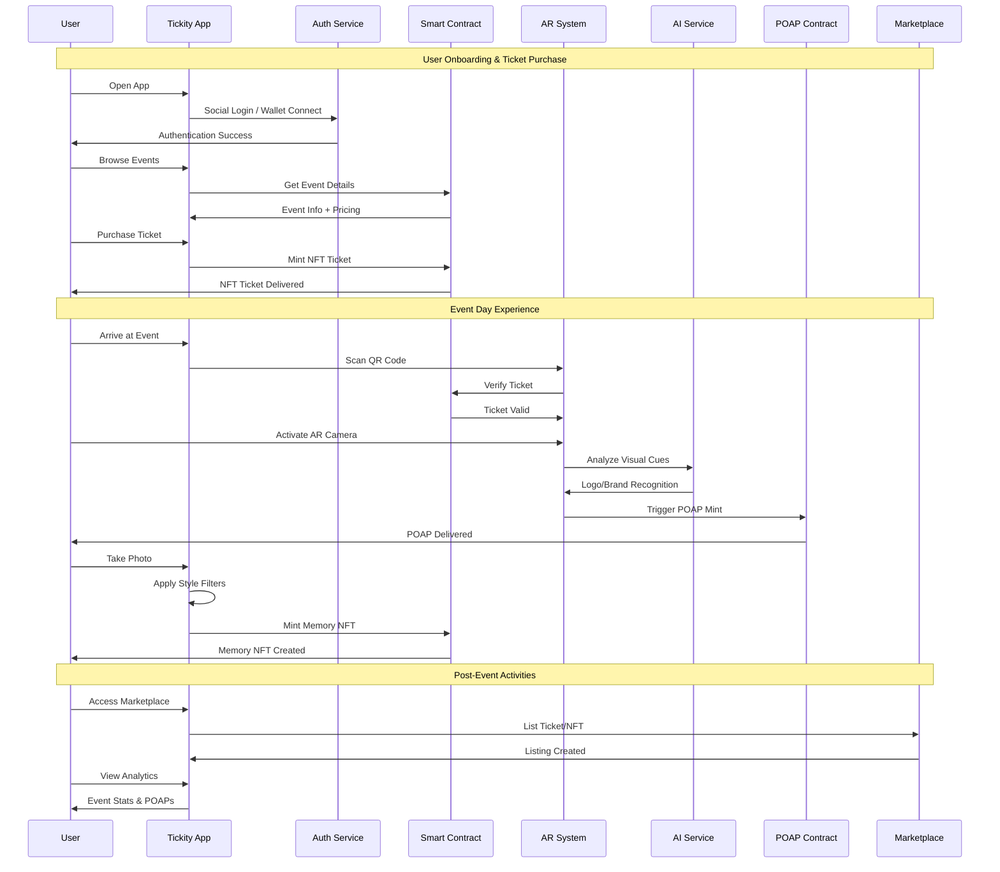

# 🎟️ Tickity

NFT ticketing platform with Geofencing, AR & AI integration built on Etherlink.

## Features

- **NFT Ticketing** - ERC-721 tickets with dynamic QR codes and anti-scalping protection
- **Secure Onboarding** - Social login and geo-location checks
- **AR Experience** - Camera-based AR activation and venue navigation
- **AI Recognition** - Real-time logo detection and context-aware POAP minting
- **Memory Generation** - Stylized photo filters with NFT collectible output
- **POAP Minting** - Instant gasless minting with smart retry logic
- **Marketplace** - In-app resale with onchain royalty enforcement
- **Organizer Dashboard** - Event management and analytics
- **Cross-Platform** - Discord/Telegram automation and deep linking

## User Flow

## Tech Stack

- **Blockchain**: Etherlink (Tezos Layer 2)
- **Smart Contracts**: Thirdweb SDK/Foundry
- **Oracle Integration**: Redstone Protocol
- **Storage**: IPFS
- **Indexing**: Goldsky Subgraph
- **AR/AI**: Custom mobile implementation
- **Frontend**: Mobile-first React Native/Flutter

## SDK & Service Integrations

> **Thirdweb SDK Integration :**
>
> - Using official Thirdweb SDK for:
>   - Wallet connection and authentication ([thirdweb.ts](tickity-rn-app/constants/thirdweb.ts))
>   - Smart contract interactions ([useGetUserTickets.tsx](tickity-rn-app/hooks/useGetUserTickets.tsx))
>   - Batch Transactions [Approval USDT + Purchasing Ticket] ([sendBatchTxn](tickity-rn-app/app/%5Bevent%5D.tsx#L214))
>   - Chain configuration with etherlinkTestnet ([useGetUSDT.tsx](tickity-rn-app/hooks/useGetUSDT.tsx))
>   - Event creation and management ([ThirdwebScreen.tsx](tickity-rn-app/components/ThirdwebScreen.tsx))

> **Goldsky Subgraph Integration :**
>
> - Using Goldsky subgraph for:
>   - Event data indexing and querying ([subgraph.ts](tickity-rn-app/constants/subgraph.ts))
>   - Real-time event updates ([useGetEvents.tsx](tickity-rn-app/hooks/useGetEvents.tsx))
>   - User event management ([useGetUserEvents.tsx](tickity-rn-app/hooks/useGetUserEvents.tsx))
>   - Event filtering and search functionality ([EventsScreen.tsx](tickity-rn-app/components/EventsScreen.tsx))

> **Redstone Oracle Integration :**
>
> - Using Redstone Protocol for:
>   - Real-time price feeds ([EventFactoryWithPriceFeeds.sol](contracts/src/EventFactoryWithPriceFeeds.sol))
>   - USDT/XTZ price data integration ([TestRedStoneIntegration.s.sol](contracts/script/test/TestRedStoneIntegration.s.sol))
>   - Dynamic ticket pricing based on market conditions ([TestRedStoneXTZPrice.s.sol](contracts/script/test/TestRedStoneXTZPrice.s.sol))
>   - Oracle data validation and fallback mechanisms
---

## 🧾 Transaction Links + Ghiblified POAP 🎟️

Here’s a quick overview of the onchain actions and resulting Ghibli-style POAP minting on **Etherlink Testnet**:

---

### 🎫 Purchase Ticket  
- [View Transaction →](https://testnet.explorer.etherlink.com/tx/0x903e4cac30c7a0eca3efdf2cec48307980163173a1e86424e870d398e722c985)  
User purchases an event ticket onchain.

---

### 🪄 useTicket & POAP Minting  
- [View Transaction →](https://testnet.explorer.etherlink.com/tx/0x90d710aa415e34e9034933b588f1378f4c1fc39728381b06a923a50578ad55e8)  
Ticket is validated and a **POAP (Proof of Attendance Protocol)** NFT is minted for the attendee.

---

### 📅 Create Event  
- [View Transaction →](https://testnet.explorer.etherlink.com/tx/0xec33a5d08e0c6953149d84bf247d75f8cce1899a00e8478095b2ea817f9eb816)  
Organizer creates the event metadata and pushes it onchain.

---

### 🖼️ Ghiblified POAP NFT  
A uniquely styled **Ghibli-inspired POAP** minted to the attendee wallet:

  

